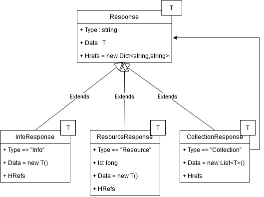

# Collares
**Coll**ections **a**nd **res**ources

## What is Collares and what is it good for

Collares is a C# library that turns your ASP.NET service into a RESTful service.


Here's a example to illustrate it. Given an ASP.NET Web service that manages your shopping list. Programmed straight forward and without Collares, The Web service returns `ShoppinglistItem`.


| Info - Source Code on GitHub                                 |
| ------------------------------------------------------------ |
| The source code for the examples is on [GitHub (Src/Collares.WebApiExample)](https://github.com/mrstefangrimm/Collares/tree/main/Src/Collares.WebApiExample) if you prefer to study the examples in Visual Studio. |


```CSharp
using Microsoft.AspNetCore.Http;
using Microsoft.AspNetCore.Mvc;

class ShoppinglistItem {
  public string Product { get; set; }
  public decimal Price { get; set; }
}

/// <summary>ASP.NET Web API for a shopping list.</summary>
[Route("api/[controller]")]
[ApiController]
public class ShoppinglistController : ControllerBase {
  /// <summary>Gets a list of items.</summary>
  [HttpGet("rawitems")]
  public IActionResult GetRawItems() {
    // Here, the items would be read from the database.
    var items = new [] { 
      new ShoppinglistItem { Product = "apples", Price = 3.49m },
      new ShoppinglistItem { Product = "pears",  Price = 2.99m } };
    // Return the items
    return Ok(items);
  }
}
```

Listing1 shows a Web service that uses the class `ShoppinglistItem` as the response type.

A request returns an array of `ShoppinglistItem`.

```bash
$ curl http://localhost:5000/api/shoppinglist/rawitems | json_pp
```

```json
[
  { "product" : "apples", "price" : 3.49 },
  { "product" : "pears",  "price" : 2.99 }
]
```

Listing2 shows a curl<sup>1</sup> command that requests the shopping list items from the service. The response is an array of shopping list items.


One reason why it's not so good to return `ShoppinglistItem` is that the client does not have additional information: Is it possible to add items, remove an item, change an item?

By using the Collares response types, this information is transported to the client along with the `ShoppinglistItem` which is now the payload of the message.

```CSharp
using Collares;
using Microsoft.AspNetCore.Http;
using Microsoft.AspNetCore.Mvc;

using ShoppinglistItemsResponse 
  = WebApiCollectionResponse<ShoppinglistItemResponse, ShoppinglistItem>;

class ShoppinglistItem {
  public string Product { get; set; }
  public decimal Price { get; set; }
}
class ShoppinglistItemResponse : WebApiResourceResponse<ShoppinglistItem> {}

/// <summary>ASP.NET Web API for a shopping list.</summary>
[Route("api/[controller]")]
[ApiController]
public class ShoppinglistController : ControllerBase {
  /// <summary>Gets a list of items.</summary>
  [HttpGet("items")]
  public IActionResult GetItems() {
    // Here, the items would be read from the database.
    var items = new[] {
      new ShoppinglistItem { Product = "apples", Price = 3.49m },
      new ShoppinglistItem { Product = "pears",  Price = 2.99m } };

    // Create the response
    ShoppinglistItemsResponse response = new();
    response.AddHref(HrefType.Post, $"api/shoppinglist/items");
    for (int n = 0; n < items.Length; n++) {
      ShoppinglistItemResponse itemResponse = new() { Id = n + 1 };
      itemResponse.Data.CopyFrom(items[n]);
      itemResponse.AddHref(
        HrefType.Delete, $"api/shoppinglist/items/{itemResponse.Id}");
      itemResponse.AddHref(
        HrefType.Patch, $"api/shoppinglist/items/{itemResponse.Id}");
      response.Data.Add(itemResponse);
    }
    return Ok(response);
  }
}
```

Listing3 shows a Web service that uses `WebApiCollectionResponse` as the response.

A request returns a `WebApiCollectionResponse` .

```bash
$ curl http://localhost:5000/api/shoppinglist/items | json_pp
```

```json
{
  "type" : "Collection",  
  "data" : [
    { 
      "type" : "Resource",
      "id" : 1,
      "data" : {
        "product" : "apples",
        "price" : 3.49 },
      "hrefs" : { 
        "delete" : "api/shoppinglist/items/1",
        "patch" : "api/shoppinglist/items/1" }
    },
    { 
      "type" : "Resource",
      "id" : 2,
      "data" : {
        "product" : "pears",
        "price" : 2.99 },
      "hrefs" : {
        "delete" : "api/shoppinglist/items/2",
        "patch" : "api/shoppinglist/items/2" }}
   ],
   "hrefs" : {
      "post" : "api/shoppinglist/items"
   },
}
```

Listing3 shows a curl<sup>1</sup> command that requests the shopping list items from the service. The response is a list of `ShoppinglistItem` (as the payload in "data") enriched with possible actions for the list and the individual items.


A client application can extract additional information from the response:

- It's a collection of items
- The service allows the client to post<sup>2</sup> items to the collection
- The items in the collection are resources
- The service allows the client to delete<sup>3</sup> or to patch<sup>4</sup> a item

With this information you can, for example, enable or disable the add button in your Web application.


The example has shown that with just a few additional lines of code, the Web API response was improved. To keep it short, the example didn't include database access and error handling.


| Info - Data Transfer Objects (DTO) and Data Payload Objects  |
| ------------------------------------------------------------ |
| DTO are  class  implementations decoupled from your business logic<sup>5</sup>. In my opinion doing this by hand is a lot of manual work and expensive to maintain. <br/>Collares uses a pattern also called "Data Payload Objects" (sorry, I don't have a reference for that). The class `ShoppinglistItem` is both the payload on the Web interface and is used in the business logic. |


---

<sup>1</sup> curl is a command-line tool that is useful for manual testing. You get the same result if you copy the URL into the browser's URL field.

<sup>2</sup> post  is not part of the example to keep it short. Post is used to add an item.

```CSharp
[HttpPost("items/{id}")]
public IActionResult PostItem(long id, ShoppinglistItem item) {
 // Here, you would add the item to the database
}
```

<sup>3</sup> delete is not part of the example to keep it short.

```CSharp
[HttpDelete("items/{id}")]
public IActionResult DeleteItem(long id) {
 // Here, you would delete the item with the given id from the database
}
```

<sup>4</sup> patch is not part of the example to keep it short. Patch is used to modify an item.

```CSharp
[HttpPatch("items/{id}")]
public IActionResult PatchItem(long id, ShoppinglistItem item) {
  // Here, you would try to locate the item with the given id in the database and then modify it with the item
}
```
<sup>5</sup> Patterns of Enterprise Application Architecture, Martin Fowler, 2003.


## Collares and REST

One of the principles for a RESTful service is a uniform interface<sup>6</sup>. HATEOAS is another term for this uniform interface. The goal of the uniform interface is that the client need know little about the application it is communicating with.

Collares has the three types "Collection", "Info" and "Resource" with always the same properties. What is dynamic is the payload  (stored in the property "Data") and the number of entries in HRefs.


 

Figure1 shows a class diagram of the three possible Collares response types. This turns the Web API interface a uniform interface.


Table1 explains the four possible properties. A response type always has the same properties.

| Property | Description                                                  |
| -------- | ------------------------------------------------------------ |
| Type     | is always either 'Collection', 'Resource' or 'Info'.         |
| HRefs    | is a dictionary of possible actions. Predefined are: Self, Get, Post, Put, Patch, Delete. This list is extensible. |
| Id       | is the unique resource id. Often this is also used as the primary key of the database. |
| Data     | is the payload respectively the value object. Note that the Id is part of the interface and not part of the payload. |


---
<sup>6</sup> REST on Wikipedia or any other source you find on the topic: https://en.wikipedia.org/wiki/Representational_state_transfer


## Web API response types

The example in the section above showed how to create a Web API response with the two types ` WebApiCollectionResponse`  and ` WebApiResourceResponse`.

In this section an example will be made for all three types - Resource, Collection and Info as we learned.


### Type Resource Response

A resource has a unique Id. The "Data" property (the payload) is the value object. If the service allows, a resource can be directly accessed, patched or deleted.

#### Example

```CSharp
[HttpGet("items/{id}")]
public IActionResult GetItem(long id) {
  // Here, the items would be read from the database.
  var items = new[] {
    new ShoppinglistItem { Product = "apples", Price = 3.49m },
    new ShoppinglistItem { Product = "pears",  Price = 2.99m } };
  // Create the response
  ShoppinglistItemResponse response = new() { Id = id };
  response.Data.CopyFrom(items[id - 1]);
  // Notification to the application that it can delete or patch this resource
  response.AddHref(HrefType.Delete, $"api/shoppinglist/items/{response.Id}");
  response.AddHref(HrefType.Patch, $"api/shoppinglist/items/{response.Id}");
  return Ok(response);
}
```

Query:

```bash
$ curl http://localhost:5000/api/shoppinglist/items/2 | json_pp
```

Response:

```json
{
  "type" : "Resource",
  "id" : 2,
   "data" : {
     "price" : 2.99,
     "product" : "pears"
   },
   "hrefs" : {
     "delete" : "api/shoppinglist/items/2",
     "patch" : "api/shoppinglist/items/2"
   }
}
```


### Type Collection Response

A collection doesn't have an Id. The property "Data" (the payload) is always list  of type Resource.

#### Example

```CSharp
[HttpGet("items")]
public IActionResult GetItems() {
  // Here, the items would be read from the database.
  var items = new[] {
    new ShoppinglistItem { Product = "apples", Price = 3.49m },
    new ShoppinglistItem { Product = "pears",  Price = 2.99m } };
  // Create the response
  ShoppinglistItemsResponse response = new();
  response.AddHref(HrefType.Post, $"api/shoppinglist/items");
  for (int n = 0; n < items.Length; n++) {
    ShoppinglistItemResponse itemResponse = new() { Id = n + 1 };
    itemResponse.Data.CopyFrom(items[n]);
    itemResponse.AddHref(
      HrefType.Delete, $"api/shoppinglist/items/{itemResponse.Id}");
    itemResponse.AddHref(
      HrefType.Patch, $"api/shoppinglist/items/{itemResponse.Id}");
    response.Data.Add(itemResponse);
  }
  return Ok(response);
}
```

Query: 

```bash
$ curl http://localhost:5000/api/shoppinglist/items | json_pp
```

Response:

```json
{
  "type" : "Collection",  
  "data" : [
    { 
      "type" : "Resource",
      "id" : 1,
      "data" : {
        "product" : "apples",
        "price" : 3.49 },
      "hrefs" : { 
        "delete" : "api/shoppinglist/items/1",
        "patch" : "api/shoppinglist/items/1" }
    },
    { 
      "type" : "Resource",
      "id" : 2,
      "data" : {
        "product" : "pears",
        "price" : 2.99 },
      "hrefs" : {
        "delete" : "api/shoppinglist/items/2",
        "patch" : "api/shoppinglist/items/2" }
     }
   ],
   "hrefs" : {
      "post" : "api/shoppinglist/items"
   }
}
```

### Type Info Response

An info response doesn't have an Id.  The "Data" property (the payload) is a value object, but this is optional. The payload could be the number of entries in a collection. This allows the client to first learn about the collection before requesting it.

Another use case for "info" is to tell the client whether it's allowed to request or modify a collection without actually requesting the collection.

#### Example

Data is a value object. The HRef "post" of the info object indicates that items can be added. "get" is missing so the client might be not allowed to request the collection and see all the entries.

```CSharp
[HttpGet("items/info")]
public IActionResult GetItemsInfo() {
  // Create the response
  WebApiInfoResponse<object> response = new();
  response.AddHref(HrefType.Post, $"api/shoppinglist/items");
  if (false) {
    response.AddHref(HrefType.Get, $"api/shoppinglist/items");
  }
  return Ok(response);
}
```

Query:

```bash
$ curl http://localhost:5000/api/shoppinglist/items/info | json_pp
```

Response:

```json
{
   "type" : "Info",
   "data" : {},
   "hrefs" : {
      "post" : "api/shoppinglist/items"
   }
}
```


## License

<a rel="license" href="http://creativecommons.org/licenses/by-sa/4.0/"></a>

This work is licensed under the Creative Commons Attribution-ShareAlike 4.0 International License. To view a copy of this license, visit http://creativecommons.org/licenses/by-sa/4.0/ or send a letter to Creative Commons, PO Box 1866, Mountain View, CA 94042, USA.


